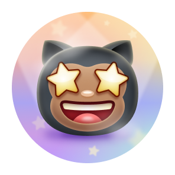

<div align="center">

# OBTAIN

*A practical route to every earnable badge — how, and why it works.*

</div>

---

## Before you start

Every method below relies on things you'd plausibly do anyway: contributing to a project, reviewing someone's code, sharing something worth starring. None of it requires deception, and GitHub's spam-detection has gotten sharp enough that farmed, low-effort PRs against toy repositories are routinely stripped of their achievement credit after the fact. Treat these as descriptions of *real* activity that happens to be counted, not as a checklist to fake.

One setting matters before anything else: achievements are visible on your profile by default. If you'd rather they stay private, that's a toggle in **Settings → Profile → Achievements**, unrelated to whether you can still earn them.

---

##  Pull Shark

**Requirement:** 2 merged pull requests to unlock; 16 / 128 / 1,024 for higher tiers.

Open a pull request against any repository — including one of your own — and get it merged. That's the entire mechanism, which is what makes this the most commonly earned badge on the platform.

**Route:**
1. If you maintain any repository, even a small personal one, open a PR against it yourself (a README fix, a dependency bump, a small refactor) and merge it. Two of these alone unlock the base tier.
2. To build toward the higher tiers meaningfully, look for public projects using the `good first issue` or `help wanted` labels — GitHub's own issue search lets you filter by these across all of GitHub. Documentation fixes and small bug patches are legitimate, welcomed contributions and count identically to larger ones.
3. Consistency beats bursts. A PR merged every so often across real projects reads — to both maintainers and to GitHub's spam filters — as normal open-source participation rather than a farming pattern.

---

##  Pair Extraordinaire

**Requirement:** 1 co-authored merged PR to unlock; 10 / 24 / 48 for higher tiers.

This one requires an actual second person — it cannot be earned solo, and that constraint is the point.

**Route:**
1. Work on a commit with another developer, then add a co-author trailer to the commit message:
   ```
   Co-authored-by: Name <email@example.com>
   ```
2. GitHub Desktop and the GitHub.com web editor both offer a native "add co-author" picker when committing collaboratively, which inserts this trailer automatically and correctly — worth using over typing it by hand if you're new to the syntax.
3. Get that commit into a pull request that merges. Pair-programming sessions, mentoring a newer contributor through their first PR, or simply reviewing and co-authoring a fix with a colleague all qualify.

---

##  Quickdraw

**Requirement:** Close an issue or PR within 5 minutes of opening it.

There's no tier here — you either hit the window or you don't.

**Route:**
1. Open an issue or pull request you control the fate of — for instance, a PR you realize on reflection isn't ready, or an issue you're filing as a placeholder.
2. Close it within five minutes. GitHub measures wall-clock time from creation to closure, not activity within that window, so this is genuinely about speed rather than substance.
3. The most honest version of this happens naturally: catching your own mistake fast, or closing a duplicate issue the moment you spot it already exists.

---

##  Galaxy Brain

**Requirement:** 2 accepted answers to unlock; 8 / 16 / 32 for higher tiers.

Since GitHub disabled achievement credit inside its own Community Discussions forum in February 2024 (a move made specifically to stop spam farming there), this badge now only accrues through Discussions enabled on individual public repositories.

**Route:**
1. Find a repository with the **Discussions** tab enabled — many active open-source projects use it for Q&A instead of, or alongside, Issues.
2. Locate a question in the **Q&A** category you can genuinely answer well.
3. Post a correct, complete answer. The badge only counts once the *original asker* marks your reply as the accepted answer, so this rewards actually solving someone's problem — not volume of replies.
4. This is naturally slower to accumulate than the other badges, and that's a reasonable expectation to hold going in.

---

##  YOLO

**Requirement:** Merge your own pull request without a code review.

**Route:**
1. Open a pull request against a repository you have merge rights to.
2. Merge it without requesting or receiving a review approval.
3. On a repository you own outright, this happens by default unless you've configured branch protection rules requiring review — so for solo maintainers this is often the *first* achievement earned rather than one deliberately pursued.
4. Worth noting for team contexts: this badge is a fine byproduct of solo work, but deliberately skipping review on a shared codebase just to earn it works against the reason review processes exist in the first place.

---

##  Starstruck

**Requirement:** A repository you created reaches 16 stars; 128 / 512 / 4,096 for higher tiers.

The only badge on this list that depends entirely on other people's judgment, which is exactly what makes it worth earning honestly.

**Route:**
1. Build something that solves a real, specific problem — a tool, a well-organized reference (like this one), a library that fills a gap. Novelty and clarity of purpose matter more than scale.
2. Write a README that explains what the project does and why someone would want it, within the first few lines — most visitors decide whether to star within seconds of landing on a repository.
3. Share it where people who'd actually use it are already looking: relevant subreddits, topic-specific Discord or Slack communities, Hacker News' "Show HN," or your own network. Avoid mass, off-topic self-promotion — communities police that quickly, and it produces no lasting stars.
4. Let it be useful over time. Star growth is almost always gradual; treating it as a slow byproduct of good work, not a target to sprint toward, tends to produce better results anyway.

---

##  Public Sponsor

**Requirement:** Sponsor a developer or organization through GitHub Sponsors.

The most direct badge on the list — no accumulation, no tiers, no waiting on someone else.

**Route:**
1. Identify an open-source maintainer or project you rely on that has GitHub Sponsors enabled — check for a **Sponsor** button on their profile or repository.
2. Visit their Sponsors page and choose a tier. GitHub requires a payment method on file to complete this, since it's a real financial contribution, not a simulated one.
3. Confirm the sponsorship. The badge unlocks immediately afterward.
4. This is worth doing for its own sake, independent of the badge — GitHub Sponsors is one of the more direct ways to keep maintainers of tools you use able to keep maintaining them.

---

## What you can't obtain

**Arctic Code Vault Contributor** and **Mars 2020 Contributor** were tied to fixed historical snapshots — a 2020 archive event and a specific space mission's software repositories — and neither can be earned through any activity today. If a service claims otherwise, it's mistaken. Reasoning about *why* is more useful than searching for a workaround: these exist as a record of who was present at a specific moment, and no later effort can retroactively place you there. See `ACHIEVEMENTS.md` for the full detail on both.

---

<div align="center">

Curated by **Rexden** · Support: *coming soon*

</div>
